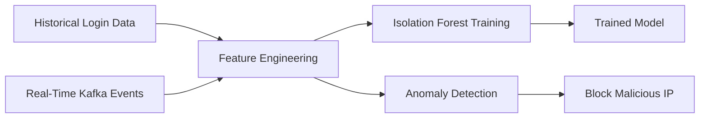
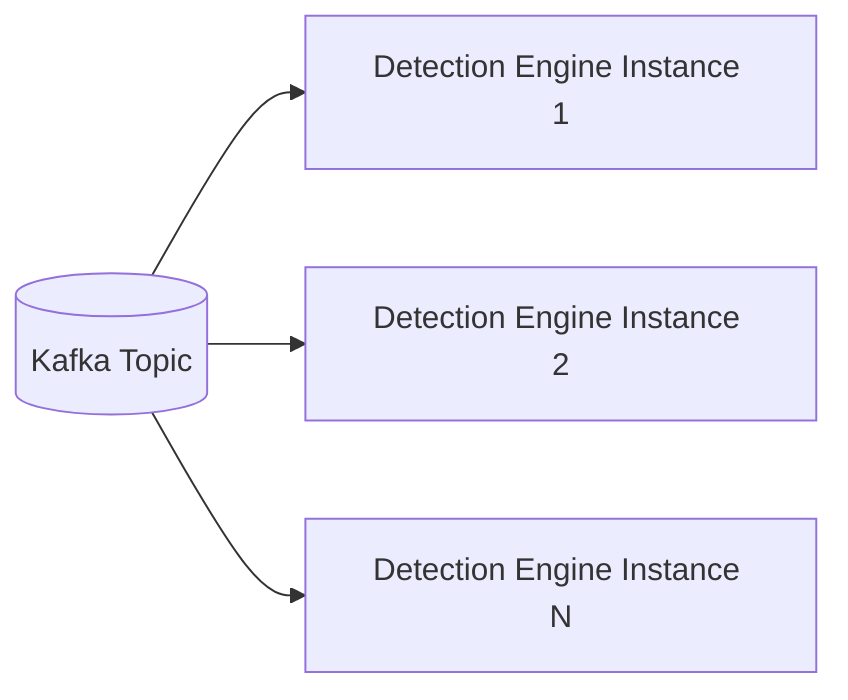

# 🛡️ Real-Time Threat Detection and Response System

> A production-grade, event-driven authentication security system that detects malicious login attempts in real time using Kafka-based event streaming and automatically mitigates threats by blocking malicious IPs for subsequent authentication attempts.


---

## 📖 Overview

This project implements a **real-time authentication threat detection and response system** capable of identifying and blocking malicious login attempts using both:

- Deterministic rule-based detection
- Machine learning anomaly detection

The system uses an **event-driven architecture powered by Apache Kafka**, enabling scalable, asynchronous, and fault-tolerant security monitoring.

It automatically detects attacks such as:

- Brute force attacks
- Credential stuffing
- Bot attacks
- Behavioral anomalies
- Account takeover attempts

and enforces automated mitigation by blocking malicious IP addresses immediately after detection, preventing further malicious activity.

---

## ✨ Key Features

- Real-time threat detection pipeline
- Machine learning anomaly detection using Isolation Forest
- Rule-based deterministic detection engine
- Automatic malicious IP blocking
- Event-driven architecture using Kafka
- Horizontally scalable detection engines
- Fully asynchronous processing
- Automated mitigation enforcement
- Production-grade distributed system design

---

## 🏗️ System Architecture

```mermaid
flowchart LR

    Client[Client / User]

    AuthService[Spring Boot Authentication Service<br>Login Processing<br>Kafka Producer]

    Kafka[(Apache Kafka<br>auth-events topic)]

    RuleEngine[Rule-Based Detection Engine<br>Python Service]

    MLEngine[ML Anomaly Detection Engine<br>Isolation Forest Model]

    Database[(PostgreSQL<br>blocked_ips table)]

    Enforcement[Auth Service Enforcement Layer<br>Blocks Malicious Requests]

    Client --> AuthService

    AuthService -->|Publish Login Event| Kafka

    Kafka --> RuleEngine
    Kafka --> MLEngine

    RuleEngine -->|Block malicious IP| Database
    MLEngine -->|Block malicious IP| Database

    Database --> Enforcement

    Enforcement --> AuthService

    AuthService --> Client
````

---

## ⚙️ Architecture Explanation

### Authentication Service (Spring Boot)

Responsibilities:

* Processes login requests
* Publishes authentication events to Kafka
* Checks blocked IP database
* Enforces IP blocking (HTTP 403)

Acts as:

* Event Producer
* Enforcement Layer

---

### Apache Kafka (Event Streaming Layer)

Provides:

* Real-time event streaming
* Asynchronous processing
* Fault tolerance
* Horizontal scalability

Topic used:

```
auth-events
```

---

### Rule-Based Detection Engine (Python)

Detects known attack patterns using deterministic logic:

* Brute force attacks
* Rapid IP switching
* Impossible travel detection

Uses sliding window algorithms and behavioral rules.

---

### Machine Learning Detection Engine (Python)

Uses:

```
Isolation Forest
```

Detects:

* Unknown attacks
* Behavioral anomalies
* Credential stuffing
* Bot activity
* Account takeover attempts

---

### PostgreSQL Database

Stores:

```
blocked_ips
```

Schema:

```sql
CREATE TABLE blocked_ips (
    ip_address TEXT PRIMARY KEY,
    blocked_at TIMESTAMP DEFAULT CURRENT_TIMESTAMP,
    blocked_until TIMESTAMP NOT NULL,
    reason TEXT
);
```

Acts as:

* Central mitigation store
* Shared enforcement database

---

## 🔄 Event Flow

1. User attempts login
2. Auth Service processes request
3. Auth Service publishes event to Kafka
4. Detection engines consume events
5. Threat detection engines identify malicious behavior
6. Malicious IP stored in PostgreSQL
7. Auth Service blocks future requests automatically

---

## 🧠 Machine Learning Architecture

Detection pipeline:



---

## 📊 Engineered Features

Examples:

| Feature             | Purpose                     |
| ------------------- | --------------------------- |
| failures_per_ip     | Detect brute force          |
| attempt_count_ip    | Identify excessive requests |
| unique_users_per_ip | Detect credential stuffing  |
| failure_rate        | Behavioral anomaly          |
| delta_t             | Request frequency           |
| hour_of_day         | Temporal anomaly            |

---

## 🚨 Detection Methods

### Rule-Based Detection

* Sliding window brute force detection
* Impossible travel detection
* Rapid IP switching detection

Example threshold:

```
> 5 failed attempts in 60 seconds
```

---

### Machine Learning Detection

Model used:

```
Isolation Forest
```

Detects:

* Unknown attack patterns
* Behavioral anomalies
* Credential stuffing attacks
* Bot-driven authentication attempts

---

## 🧱 Tech Stack

| Layer              | Technology       |
| ------------------ | ---------------- |
| Backend            | Spring Boot      |
| Language           | Java 17          |
| Detection Engines  | Python           |
| Machine Learning   | scikit-learn     |
| Streaming Platform | Apache Kafka     |
| Database           | PostgreSQL       |
| Messaging          | Kafka            |
| ML Model           | Isolation Forest |

---

## 🚀 Installation and Setup

### Prerequisites

* Java 17
* Python 3
* Apache Kafka
* PostgreSQL
* Maven

---

### Start Kafka

```bash
localhost:9092
```

---

### Setup Database

```sql
CREATE DATABASE security_db;
```

```sql
CREATE TABLE blocked_ips (
 ip_address TEXT PRIMARY KEY,
 blocked_at TIMESTAMP DEFAULT CURRENT_TIMESTAMP,
 blocked_until TIMESTAMP NOT NULL,
 reason TEXT
);
```

---

### Run Authentication Service

```bash
mvn spring-boot:run
```

---

### Run Rule-Based Detection Engine

```bash
python threat_monitor.py
```

---

### Run ML Detection Engine

```bash
python ml_threat_detection_engine.py
```

---

## 🧪 Example Attack Simulation

```bash
curl -X POST http://localhost:8080/api/auth/login \
-H "Content-Type: application/json" \
-d '{"username":"admin","password":"wrong"}'
```

Result:

```
IP automatically blocked
Future requests return HTTP 403
```

---

## 📈 Scalability Architecture

Kafka enables horizontal scaling:



---

## 📌 Real-World Applications

* Identity providers
* Banking authentication systems
* Enterprise security platforms
* Cloud authentication systems
* Security Operations Centers (SOC)
* Zero Trust security systems

---

## 🔮 Future Enhancements

* Real-time dashboard visualization
* Kubernetes deployment
* Redis caching layer
* Online model retraining
* Advanced behavioral modeling
* Integration with SIEM systems

---

## 👨‍💻 Author

Vasan S P

GitHub: [https://github.com/vasan12sp](https://github.com/vasan12sp)

---

## 📄 License

MIT License


